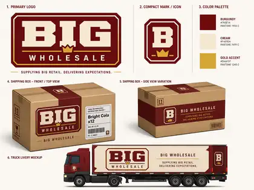
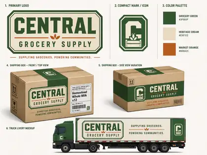
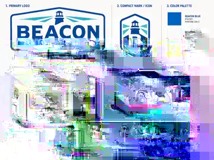

# Big Retail — Supplier Visual Identity Archive

This folder is the organized visual-reference archive for **supplier companies** in Big Retail.

The canonical design rules for how supplier identity works live in [`../../SupplierVisualIdentity.md`](../../SupplierVisualIdentity.md). This folder holds the visual boards and future source/reference assets that support those rules.

## Organization

Each supplier receives its own folder so the archive can grow without turning into one flat pile of images.

Recommended contents as a supplier matures:

- `identity-board.webp` — current overall visual direction;
- `logo.*` — cleaned production logo when one exists;
- `compact-mark.*` — small-scale/icon version;
- `box-reference.*` — shipping-case treatment;
- `truck-reference.*` — delivery-vehicle treatment;
- additional named references only when they become useful.

These files are **design/art references**, not Unity runtime assets. Production sprites, textures, prefabs, and other game-ready assets belong in the appropriate Unity `Assets/` locations when implemented.

## Opening suppliers

### BIG Wholesale

Folder: [`BIGWholesale/`](BIGWholesale/)

Current read: powerful, polished, broad, immediate, expensive. Burgundy / cream / gold.

### Central Grocery Supply

Folder: [`CentralGrocerySupply/`](CentralGrocerySupply/)

Current read: practical, dependable regional grocery distribution. Green / heritage cream / orange.

### Beacon Beverage Distribution

Folder: [`BeaconBeverageDistribution/`](BeaconBeverageDistribution/)

Current read: crisp, energetic beverage-route specialist. Blue / white / teal.

## Important separation

Supplier branding communicates **who delivered the freight**. Consumer branding communicates **what product the customer buys**.

A Bright Cola case can therefore carry BIG, Central, or Beacon shipping identity while the Bright Cola product itself remains a Bright Beverage Co. product.

## Growth rule

When a new supplier is accepted, add one supplier folder here rather than creating unrelated visual-identity files elsewhere in the repository. Start with an `identity-board` if that is all we have; split out production logo/mark/vehicle/box assets only when implementation actually needs them.
